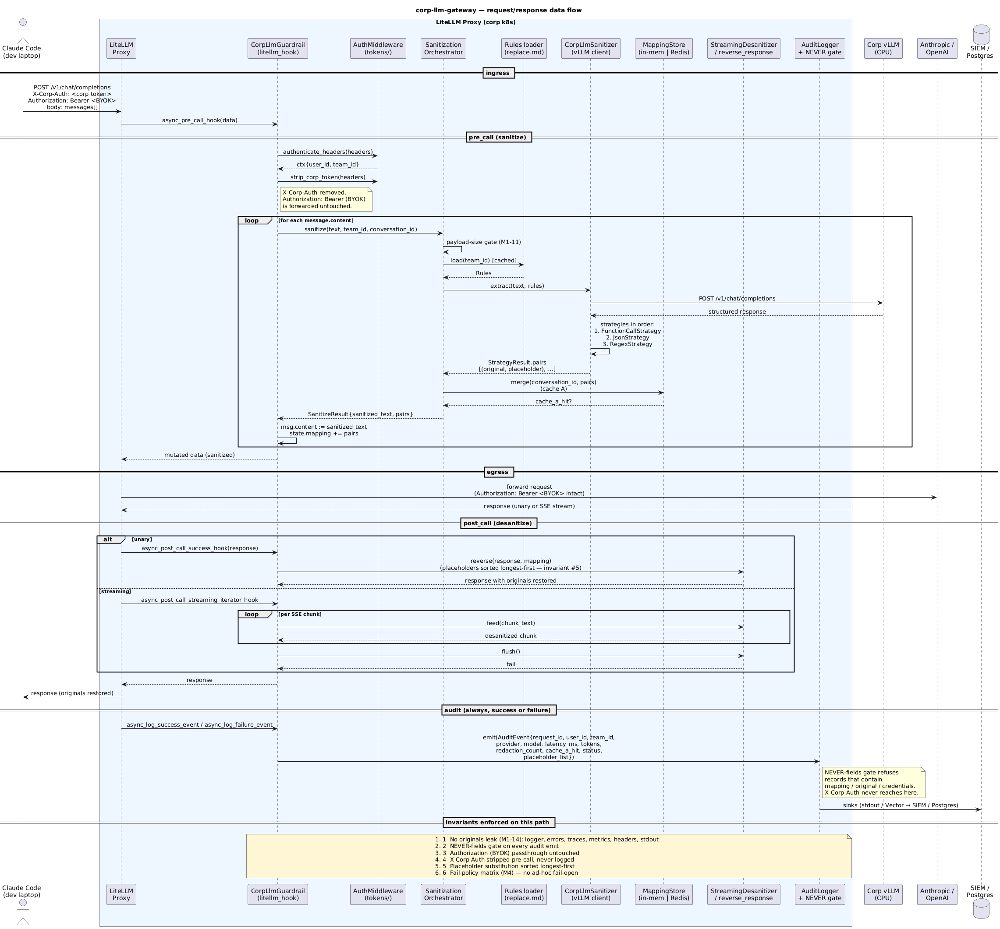

# corp-llm-gateway

Corporate LLM gateway. Sanitizes traffic between developer Claude Code instances and Anthropic / OpenAI before it leaves the corp boundary.

Replaces the per-laptop `data-sanitizer` Claude Code plugin (which only covered user prompts) with a centrally-enforced, auditable, multi-provider gateway.

## Status

v1 — pre-execution. See [`docs/plans/20260507-external-sanitizer-gateway-v1.md`](docs/plans/20260507-external-sanitizer-gateway-v1.md). Non-negotiable success criterion: **zero confirmed leak incidents** in the 90 days post-GA.

## Table of contents

- [Overview](#overview)
- [Architecture](#architecture)
- [Repo layout](#repo-layout)
- [Developer quickstart (laptop)](#developer-quickstart-laptop)
  - [Install](#install)
  - [Verify](#verify)
  - [Day-to-day use](#day-to-day-use)
  - [Token rotation](#token-rotation)
- [Operator quickstart (k8s)](#operator-quickstart-k8s)
  - [What gets deployed](#what-gets-deployed)
  - [Install / upgrade](#install--upgrade)
  - [Health checks](#health-checks)
  - [Day-2 ops](#day-2-ops)
- [CLIs](#clis)
- [Configuration (Helm values)](#configuration-helm-values)
- [Conversation identity](#conversation-identity)
- [`X-Corp-Auth` token flow](#x-corp-auth-token-flow)
- [Documentation index](#documentation-index)
- [Development](#development)
- [Owner](#owner)

## Overview

A laptop harness (Claude Code, Codex, Cursor) talks HTTP to `gateway.corp.lan`. The gateway is a LiteLLM proxy with a custom guardrail (`corp_llm_gateway.litellm_hook.CorpLlmGuardrail`) registered as a callback. Every request is sanitized in `pre_call`, forwarded to Anthropic / OpenAI with the developer's BYOK key intact, de-sanitized in `post_call`, and audited. Two headers matter on the wire:

| Header | Source | Purpose |
|---|---|---|
| `X-Corp-Auth` | `~/.corp-llm-gateway/token` (laptop) | corp identity / team resolution; **stripped** before egress |
| `Authorization: Bearer …` | dev's Anthropic / OpenAI key | BYOK passthrough; forwarded **untouched** |

Full per-request data flow:



Source: [`docs/data-flow.puml`](docs/data-flow.puml) (re-render with `plantuml docs/data-flow.puml`).

## Architecture

Architecture B (assemble best-of-breed): single custom Python guardrail plugged into LiteLLM proxy; everything else (audit pipeline, auth, observability) is open-source operated.

```
Claude Code → gateway.corp.lan → LiteLLM (with custom guardrail) → api.anthropic.com / api.openai.com
                                       │
                                       ├── pre_call:  sanitize via three-tier strategies (FunctionCall → JSON → Regex)
                                       ├── post_call: de-sanitize streaming / unary response (longest-first substitution)
                                       └── audit:     Vector → Langfuse + S3 + SIEM (NEVER-fields gate)
```

Full architecture in the v1 plan.

## Repo layout

```
src/corp_llm_gateway/   Python guardrail (LiteLLM custom hooks + sanitizer engine)
  auth/                 corp-LLM auth provider (Noop default; Bearer/mTLS/OIDC stubs)
  audit/                AuditEvent + Logger + Sinks + retention generator + NEVER-fields gate
  cli/                  gateway-admin (operators), corp-llm-gateway status (devs), proxy
  corp_llm/             httpx client speaking vLLM /v1/chat/completions
  detectors/            PIIDetector + ShadowDetector
  healthz/              live / ready / sanitization deep-check
  payload/              size threshold + gzip + per-team quota
  rules/                replace.md parser + cached file loader
  sanitizer/            three-tier strategies + engine + StreamingDesanitizer + orchestrator
  storage/              MappingStore (in-memory + Redis)
  team_config/          TeamConfig + store
  tokens/               schema.sql + AuthMiddleware + TokenIssuer
  litellm_hook.py       CorpLlmGuardrail — LiteLLM callback adapter
helm/corp-llm-gateway/  Helm chart (deployment, service, configmap, NetworkPolicy, CoreDNS sinkhole)
docs/                   plan + audit-schema + ops/* + rbac-matrix + data-flow + integration docs
scripts/install.sh      laptop installer (bash/zsh/fish, macOS/Linux)
tests/                  pytest, pytest-asyncio mode=auto (265 tests, ~16s)
```

## Developer quickstart (laptop)

### Install

```bash
curl -fsSL https://git.corp.lan/<group>/corp-llm-gateway/-/raw/master/scripts/install.sh | bash
```

What it does ([`scripts/install.sh`](scripts/install.sh)):

1. Detects shell (bash / zsh / fish), writes `ANTHROPIC_BASE_URL`, `OPENAI_BASE_URL`, `CORP_GATEWAY_TOKEN_FILE`, and (for Claude Code) `ANTHROPIC_CUSTOM_HEADERS` into your rc file between `# >>> corp-llm-gateway >>>` markers.
2. Runs Keycloak device-flow OAuth and writes a 30-day corp token to `~/.corp-llm-gateway/token` (`0600`).
3. Smokes the gateway with a redactable string and verifies round-trip.

Re-running the installer is idempotent — it rotates the token and rewrites the rc block.

### Verify

```bash
exec $SHELL -l           # pick up the new env
corp-llm-gateway status  # → token_present=yes, live=yes, healthy=yes
```

### Day-to-day use

Three integration patterns depending on your harness — full recipes in [`docs/harness-integration.md`](docs/harness-integration.md):

| Harness | Recommended | Fallback |
|---|---|---|
| Claude Code | env var (`ANTHROPIC_CUSTOM_HEADERS`, set by `install.sh`) | localhost proxy |
| Codex CLI | `~/.codex/config.toml` `[default.headers]` | localhost proxy |
| Cursor / Continue | app's custom-header settings field | localhost proxy |
| `curl`, raw scripts | `--header 'X-Corp-Auth: …'` | localhost proxy |

Localhost proxy (Pattern 3) is universal — it injects `X-Corp-Auth` per request and re-reads the token file every call, so token rotation takes effect immediately:

```bash
corp-llm-gateway-proxy --listen 127.0.0.1:9999 --upstream https://gateway.corp.lan
export ANTHROPIC_BASE_URL='http://127.0.0.1:9999'
export OPENAI_BASE_URL='http://127.0.0.1:9999/v1'
```

### Token rotation

Tokens expire every 30 days. With the default Pattern 1 setup, the value is read from disk **once at shell start** (`$(cat …)` snapshot) — so after rotation:

- **Pattern 1 / 2:** open a new shell (or restart the harness).
- **Pattern 3 (proxy):** nothing — the next request picks up the new token automatically.

To rotate manually before expiry, re-run `install.sh`. Full token-flow lifecycle, freshness model, and failure-mode mapping: [`docs/x-corp-auth.md`](docs/x-corp-auth.md).

## Operator quickstart (k8s)

### What gets deployed

The Helm chart ([`helm/corp-llm-gateway/`](helm/corp-llm-gateway/)) ships:

| Workload | Container(s) | Purpose |
|---|---|---|
| `Deployment/gateway` | `litellm` (proxy + guardrail) + `vector` (audit pipeline sidecar) | request path + audit egress |
| `Service/gateway` | — | ClusterIP fronting the deployment |
| `Ingress/gateway` | — | TLS termination at `ingress.host` (default `gateway.corp.lan`) |
| `ConfigMap/*-vector` | — | Vector pipeline + NEVER-fields VRL filter |
| `NetworkPolicy` (optional) | — | constrains egress to upstream + corp-internal CIDRs |
| CoreDNS sinkhole (optional) | — | blocks direct `api.anthropic.com` / `api.openai.com` resolution from the cluster |

External dependencies (not provisioned by the chart): Redis cluster, Postgres, corp vLLM endpoint, Vector sinks (Langfuse / S3 / SIEM).

### Install / upgrade

```bash
# staging
helm upgrade --install gw helm/corp-llm-gateway \
  -f values-staging.yaml --version v0.x.y -n corp-llm-gateway

# wait for readiness across all replicas
kubectl -n corp-llm-gateway rollout status deploy/gateway

# deep sanitization check
curl https://gateway-staging.corp.lan/healthz/sanitization

# promote to prod against values-prod.yaml
```

Rollback: `helm rollback gw <revision>` (Helm keeps the last 10). Full release flow + rollback in [`docs/ops/runbook.md`](docs/ops/runbook.md).

### Health checks

| Endpoint | Used by | Asserts |
|---|---|---|
| `/healthz/live` | k8s livenessProbe | process up |
| `/healthz/ready` | k8s readinessProbe | dependencies (Redis, Postgres, corp-LLM) reachable |
| `/healthz/sanitization` | post-deploy smoke | end-to-end pre→post round-trip with redactable string |

### Day-2 ops

Source of truth: [`docs/ops/runbook.md`](docs/ops/runbook.md) (incident playbook, fail-policy matrix, common operations like `gateway-admin team create`, `gateway-admin token revoke`, kubectl one-liners).

Capacity sizing per phase (Phase 0 alpha → Phase 3 GA at 1000 devs / 50 RPS aggregate): [`docs/ops/capacity.md`](docs/ops/capacity.md).

## CLIs

| Command | Audience | Purpose |
|---|---|---|
| `corp-llm-gateway status` | dev | laptop diagnostics — token present, gateway live, version, update check |
| `corp-llm-gateway-proxy` | dev | localhost header-injecting proxy (Pattern 3) |
| `gateway-admin` | operator | team CRUD, retention config, token issue / revoke |

Entry points are wired via `pyproject.toml`'s `[project.scripts]`. The `gateway-admin` CLI runs against the production deployment (typically via `kubectl exec`).

## Configuration (Helm values)

Defaults in [`helm/corp-llm-gateway/values.yaml`](helm/corp-llm-gateway/values.yaml). Most-touched keys:

| Key | Default | What it controls |
|---|---|---|
| `replicaCount` | `3` | gateway pods (3 = redis-quorum-friendly) |
| `litellm.versionPin` | `1.40` | LiteLLM image tag — bump only after staging upgrade gate |
| `corpLlm.endpoint` | `""` | URL of the corp vLLM that powers the pre-pass redaction |
| `corpLlm.authProvider` | `"noop"` | switch to a real provider when corp-LLM gains auth (config-only, no code change) |
| `guardrail.contentSizeThresholdBytes` | `102400` | M1-11 oversize-skip threshold |
| `guardrail.cacheA.ttlSeconds` | `36000` | content-keyed dedup TTL |
| `guardrail.cacheA.perTeamQuotaBytes` | `1 GiB` | per-team Cache A budget |
| `guardrail.cacheB.slidingTtlSeconds` | `3600` | per-conversation mapping TTL (sliding) |
| `audit.vector.bufferGb` | `5` | on-pod Vector disk buffer |
| `audit.sinks.{langfuse,s3,siem}.enabled` | all `true` | toggle individual audit sinks |
| `token.ttlDays` | `30` | corp-token validity |
| `token.revocationCacheSeconds` | `60` | upper bound on revocation propagation |
| `failPolicy.*` | see file | per-component fail-closed / continue posture (M4 matrix) |
| `coreDnsSinkhole.enabled` | `false` | block direct upstream resolution from the cluster |
| `networkPolicy.enabled` | `false` | constrain pod egress |

The fail-policy keys are the **source of truth** — no ad-hoc fail-open paths in code.

### Property file fallback (TOML)

Every env var the app reads (`CORP_LLM_AUTH_PROVIDER`, `CORP_LLM_BEARER_TOKEN`, `CORP_GATEWAY_URL`, `CORP_GATEWAY_TOKEN_FILE`, …) can also be supplied from a TOML file. Resolution order is: env var → file → caller default — so existing deployments are unchanged. The file is searched at the first existing path of:

1. `$CORP_LLM_GATEWAY_CONFIG_FILE`
2. `~/.corp-llm-gateway/config.toml` (laptop default)
3. `/etc/corp-llm-gateway/config.toml` (server default)

Keys are flat and use the env-var names verbatim:

```toml
CORP_GATEWAY_URL          = "https://gateway.corp.lan"
CORP_GATEWAY_TOKEN_FILE   = "~/.corp-llm-gateway/token"
CORP_LLM_AUTH_PROVIDER    = "bearer"
CORP_LLM_BEARER_TOKEN     = "..."
```

Full template with every supported key: [`config.example.toml`](config.example.toml). Loader source: `src/corp_llm_gateway/config.py`.

## Conversation identity

Today the gateway mints `conversation_id` per HTTP request (it equals the request UUID). Cache A (content-keyed dedup) works; Cache B (per-conversation mapping store) is written but never reused across sibling requests because no harness or proxy supplies a stable session ID yet. Full behavior, consequences, and how to wire a real session ID are in [`docs/conversation-id.md`](docs/conversation-id.md).

## `X-Corp-Auth` token flow

The corp token lives on disk at `~/.corp-llm-gateway/token` (issued by `install.sh` via Keycloak device flow, 30-day TTL, `0600`). The header is sent on **every** HTTP request from the harness, but the *value* is typically read **once** — at shell init (Pattern 1) or harness start (Pattern 2) — so token rotation usually requires a fresh shell. The optional localhost proxy (Pattern 3) re-reads the file per request and makes rotation take effect on the next call. Full lifecycle (storage, freshness per pattern, what the gateway does with the header, common failure modes) is in [`docs/x-corp-auth.md`](docs/x-corp-auth.md). Per-harness setup recipes remain in [`docs/harness-integration.md`](docs/harness-integration.md).

## Documentation index

| Doc | What's inside |
|---|---|
| [`docs/plans/20260507-external-sanitizer-gateway-v1.md`](docs/plans/20260507-external-sanitizer-gateway-v1.md) | v1 plan (current rev in header) — single source of architectural truth |
| [`docs/data-flow.puml`](docs/data-flow.puml) + [`docs/data-flow.png`](docs/data-flow.png) | end-to-end sequence diagram (PlantUML source + rendered PNG) |
| [`docs/harness-integration.md`](docs/harness-integration.md) | per-harness setup recipes (Claude Code, Codex, Cursor, …) |
| [`docs/x-corp-auth.md`](docs/x-corp-auth.md) | corp token lifecycle, per-pattern freshness, failure modes |
| [`docs/conversation-id.md`](docs/conversation-id.md) | `conversation_id` behavior today + how to wire a real session ID |
| [`docs/audit-schema.md`](docs/audit-schema.md) | audit event schema + ALWAYS / CONDITIONAL / NEVER field classification |
| [`docs/replace-md-authoring.md`](docs/replace-md-authoring.md) | how to write per-team `replace.md` rules files |
| [`docs/rbac-matrix.md`](docs/rbac-matrix.md) | who can do what (devs / team leads / operators / security) |
| [`docs/remaining-steps.md`](docs/remaining-steps.md) | running checklist of v1 work left |
| [`docs/ops/runbook.md`](docs/ops/runbook.md) | release, rollback, incident playbook, common ops |
| [`docs/ops/capacity.md`](docs/ops/capacity.md) | sizing per rollout phase (alpha → GA) |
| [`docs/adr/`](docs/adr/) | architecture decision records |

## Development

Requires Python 3.12+.

```bash
pip install -e ".[dev]"
pre-commit install
PYTHONPATH=src .venv/bin/pytest tests/ -q     # 265 tests, ~16s
PYTHONPATH=src .venv/bin/ruff check src tests
```

Conventions, invariants, and "things NOT to do" are pinned in [`CLAUDE.md`](CLAUDE.md). Default branch is `master`. CI is CI (`the CI config`).

## Owner

corp-internal@corp.lan
