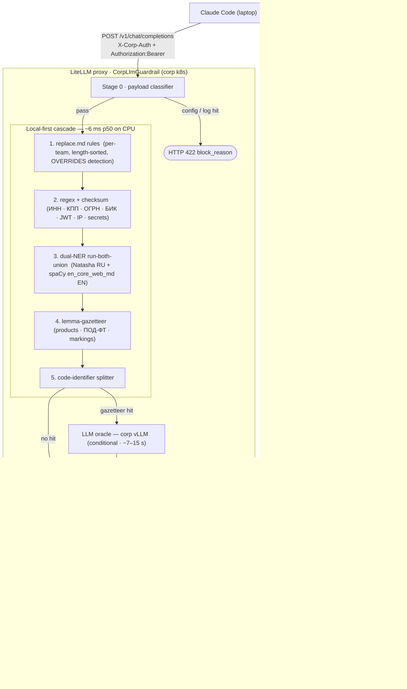

# corp-llm-gateway

[English](README.md) · **Русский**

Корпоративный LLM-шлюз. Санитизирует трафик между экземплярами Claude Code у разработчиков и Anthropic / OpenAI до того, как он покинет корпоративный периметр.

Заменяет устанавливаемый на каждый ноутбук плагин Claude Code `data-sanitizer` (который покрывал только пользовательские промпты) централизованно применяемым, аудируемым, мультипровайдерным шлюзом.

## Статус

v1 — local-first detection cascade + compliance pack реализованы; до GA. См. [`CHANGELOG.md`](CHANGELOG.ru.md), [`docs/requirements-compliance.md`](docs/requirements-compliance.md) и план проектирования [`docs/plans/20260507-external-sanitizer-gateway-v1.md`](docs/plans/20260507-external-sanitizer-gateway-v1.md). Некомпромиссный критерий успеха: **ноль подтверждённых инцидентов утечки** за 90 дней после GA.

## Оглавление

- [Обзор](#обзор)
- [Архитектура](#архитектура)
- [Возможности](#возможности)
- [Правила команды (`replace.md`)](#правила-команды-replacemd)
- [Структура репозитория](#структура-репозитория)
- [Быстрый старт для разработчика (ноутбук)](#быстрый-старт-для-разработчика-ноутбук)
  - [Установка](#установка)
  - [Проверка](#проверка)
  - [Повседневное использование](#повседневное-использование)
  - [Ротация токена](#ротация-токена)
- [Быстрый старт для оператора (k8s)](#быстрый-старт-для-оператора-k8s)
  - [Что разворачивается](#что-разворачивается)
  - [Установка / обновление](#установка--обновление)
  - [Проверки состояния](#проверки-состояния)
  - [Day-2 эксплуатация](#day-2-эксплуатация)
- [Демо (ноутбук)](#демо-ноутбук)
- [CLI-инструменты](#cli-инструменты)
- [Конфигурация (значения Helm)](#конфигурация-значения-helm)
- [Идентификация диалога](#идентификация-диалога)
- [Поток токена `X-Corp-Auth`](#поток-токена-x-corp-auth)
- [Указатель документации](#указатель-документации)
- [Разработка](#разработка)
- [На чём построено](#на-чём-построено)

## Обзор

Харнесс на ноутбуке (Claude Code, Codex, Cursor) общается по HTTP с `gateway.corp.lan`. Шлюз — это прокси LiteLLM с кастомным guardrail (`corp_llm_gateway.litellm_hook.CorpLlmGuardrail`), зарегистрированным как callback. Каждый запрос санитизируется в `pre_call`, форвардится в Anthropic / OpenAI с сохранённым BYOK-ключом разработчика, де-санитизируется в `post_call` и аудируется. В сетевом трафике важны два заголовка:

| Заголовок | Источник | Назначение |
|---|---|---|
| `X-Corp-Auth` | `~/.corp-llm-gateway/token` (ноутбук) | корп-идентичность / определение команды; **срезается** перед egress |
| `Authorization: Bearer …` | Anthropic / OpenAI-ключ разработчика | passthrough BYOK; форвардится **без изменений** |

Полный поток данных на каждый запрос: см. диаграмму в разделе [Архитектура](#архитектура) ниже.

## Архитектура

Архитектура B (сборка из лучших в своём классе компонентов): единственный кастомный Python-guardrail, встроенный в прокси LiteLLM; всё остальное (конвейер аудита, аутентификация, наблюдаемость) — на эксплуатируемом open-source.



Жизненный цикл запроса:

1. **Stage 0** — классификатор payload: сигнатуры `.env`, kubeconfig, лог-дампов → HTTP 422 `block_reason`; upstream не вызывается.
2. **Local-first каскад** (детерминированный, ~6 ms p50 на CPU):
   - правила `replace.md` для каждой команды (сортировка по длине, ПЕРЕОПРЕДЕЛЯЮТ авто-детекцию)
   - regex + checksum: ИНН / КПП / ОГРН / БИК / СНИЛС / р-счёт, JWT, PEM, `sk-` / `AKIA` / `ghp_`, IPv4/6, внутренние hostname
   - dual-NER run-both-union: Natasha/Slovnet (RU) + spaCy `en_core_web_md` (EN) — двуязычные ФИО / организации / гео
   - лемма-газеттир: кодовые имена продуктов, регулируемые термины ПОД-ФТ, грифы конфиденциальности
   - сплиттер идентификаторов кода: camel/snake-идентификаторы вида `CompanynameabcService` в коде
3. **LLM-оракул** (условный fallback): вызывается только по детерминированному попаданию в газеттир; добавляет покрытие Tier-2 для непомеченного ноу-хау. Латентность ~7–15 s против ~6 ms у локального пути. Реальность двух venv: Python 3.12 = полный NER; Python 3.14 = грациозная деградация (импорты NER ленивые, опциональный extra `[ner]`).
4. **Stage 5 DLP egress guard**: независимый пере-скан вторым слоем санитизированного исходящего payload на canary-строки и высоконадёжные секреты; блокирует всё, что уцелело.
5. **post_call**: `StreamingDesanitizer` восстанавливает оригиналы из per-conversation маппинга (плейсхолдеры отсортированы длиннейшими вперёд — инвариант #5).
6. **аудит**: Vector → Langfuse + S3 + SIEM с гейтом NEVER-полей.

Полная архитектура — в [плане v1](docs/plans/20260507-external-sanitizer-gateway-v1.md).

## Возможности

### Детекция

- **Чек-суммы российских сущностей** — ИНН (10/12), КПП, ОГРН (13/15), БИК, СНИЛС, р/счёт с валидируемыми по алгоритму чек-суммами; почти нулевой уровень ложных срабатываний
- **Двуязычный NER** — Natasha/Slovnet RU + spaCy `en_core_web_md` EN, run-both-union; покрывает ФИО, организации, адреса в смешанных по языку запросах
- **Лемма-газеттир** — кодовые имена продуктов, регулируемые термины ПОД-ФТ / AML-CFT, грифы конфиденциальности (`Коммерческая тайна`, `ДСП`, `Confidential`, `NDA`), сопоставляемые по лемме, а не по точной строке
- **Сплиттер идентификаторов кода** — разбивает camel/snake-идентификаторы (`CompanynameabcService`) и сканирует сегменты по газеттиру
- **Allowlist тестовых данных** — детерминированное исключение для тестовых фикстур; не может подавить настоящие секреты
- **Паттерны секретов** — JWT, приватный ключ PEM, значения `sk-` / `AKIA` / `ghp_` / обобщённый `password=` / `Bearer`

### Блокировка

- **Блокировка до egress (Stage 0)** — сигнатуры `.env`, kubeconfig, nginx.conf, лог-дампов → HTTP 422 с `block_reason`; upstream не вызывается
- **Stage 5 DLP egress guard** — независимый пере-скан вторым слоем санитизированного payload на canary-строки и высоконадёжные секреты; блокирует всё, что уцелело

### Аутентификация и соответствие требованиям

- **X-Corp-Auth + хранилище токенов на Postgres** — `AuthMiddleware` валидирует токены против `PostgresTokenStore` (asyncpg); верхняя граница распространения отзыва — 60 s
- **RBAC `gateway:operator`** — команды admin CLI закрыты гейтом по JWT-claim `gateway:operator`; проверяется через PyJWT против ролей realm в Keycloak
- **Конвейер аудита** — богатая схема `AuditEvent` (уровни полей ALWAYS / CONDITIONAL) + гейт NEVER-полей: логгер отклоняет записи, содержащие `mapping`, `original` или `credentials`
- **SIEM-sink** — HTTP-sink Vector с унаследованным NEVER-гейтом + Helm-алерты (`AuditVectorDropHigh`, `LeakAttemptDetected`)
- **Блокировка egress** — `NetworkPolicy` (egress подов ограничен upstream + корп-CIDR) + CoreDNS-sinkhole (блокирует прямое разрешение `api.anthropic.com` / `api.openai.com` из кластера), обе включены в `helm/.../values-prod.yaml`

**Соответствие требованиям:** ✅ 11 / 🟡 3 / ⚪ 1 из 15 требований ИБ — см. [`docs/requirements-compliance.md`](docs/requirements-compliance.md).

## Правила команды (`replace.md`)

Каждая команда ведёт файл `replace.md` по пути `<rules-dir>/<team_id>.md`. Эти правила выполняются **первыми** в локальном каскаде и **переопределяют** авто-детекцию — указанный здесь термин заменяется всегда, независимо от того, что нашли детекторы.

Формат — одно правило на строку:

```
- `ORIGINAL` → `REPLACEMENT`
```

Разделитель — `→` (U+2192), **а не** ASCII `->`. Правила применяются длиннейшими вперёд (инвариант #5). Пример:

```markdown
- `Project Polaris` → `[CONFIDENTIAL_PROJECT]`
- `acme-internal-crm.corp.lan` → `[INTERNAL_HOST]`
- `dr.smith@partnerlab.com` → `[PARTNER_CONTACT]`
```

Живой файл правил для демо — `docker/demo-litellm/rules/demo-team.md`. Полная спецификация и советы по написанию: [`docs/replace-md-authoring.md`](docs/replace-md-authoring.ru.md).

## Структура репозитория

```
src/corp_llm_gateway/   Python-guardrail (кастомные хуки LiteLLM + движок санитайзера)
  auth/                 провайдер аутентификации corp-LLM (по умолчанию Noop; заглушки Bearer/mTLS/OIDC)
  audit/                AuditEvent + Logger + Sinks + генератор retention + гейт NEVER-полей
  cli/                  gateway-admin (операторы), corp-llm-gateway status (разработчики), proxy
  corp_llm/             httpx-клиент, говорящий с vLLM /v1/chat/completions
  detectors/            PIIDetector + ShadowDetector + RegexChecksumDetector + DualNerDetector
  healthz/              live / ready / глубокая проверка sanitization
  payload/              порог размера + gzip + квота на команду
  rules/                парсер replace.md + кэширующий загрузчик файлов
  sanitizer/            local-first движок + StreamingDesanitizer + DLP guard + оркестратор
  storage/              MappingStore (in-memory + Redis)
  team_config/          TeamConfig + хранилище
  tokens/               schema.sql + AuthMiddleware + TokenIssuer
  litellm_hook.py       CorpLlmGuardrail — адаптер callback-ов LiteLLM
helm/corp-llm-gateway/  Helm-чарт (deployment, service, configmap, NetworkPolicy, CoreDNS sinkhole)
docs/                   план + audit-schema + ops/* + rbac-matrix + документы по интеграции
scripts/install.sh      установщик для ноутбука (bash/zsh/fish, macOS/Linux)
tests/                  pytest, pytest-asyncio mode=auto (546 тестов, ~16 с)
```

## Быстрый старт для разработчика (ноутбук)

### Установка

```bash
curl -fsSL https://git.corp.lan/<group>/corp-llm-gateway/-/raw/master/scripts/install.sh | bash
```

Что он делает ([`scripts/install.sh`](scripts/install.sh)):

1. Определяет shell (bash / zsh / fish), пишет `ANTHROPIC_BASE_URL`, `OPENAI_BASE_URL`, `CORP_GATEWAY_TOKEN_FILE` и (для Claude Code) `ANTHROPIC_CUSTOM_HEADERS` в ваш rc-файл между маркерами `# >>> corp-llm-gateway >>>`.
2. Выполняет OAuth device-flow через Keycloak и пишет 30-дневный корп-токен в `~/.corp-llm-gateway/token` (`0600`).
3. Прогоняет smoke-тест шлюза строкой, подлежащей маскированию, и проверяет round-trip.

Повторный запуск установщика идемпотентен — он ротирует токен и перезаписывает rc-блок.

### Проверка

```bash
exec $SHELL -l           # подхватить новое окружение
corp-llm-gateway status  # → token_present=yes, live=yes, healthy=yes
```

### Повседневное использование

Три паттерна интеграции в зависимости от вашего харнесса — полные рецепты в [`docs/harness-integration.md`](docs/harness-integration.ru.md):

| Харнесс | Рекомендуется | Резервный вариант |
|---|---|---|
| Claude Code | переменная окружения (`ANTHROPIC_CUSTOM_HEADERS`, задаётся `install.sh`) | localhost-прокси |
| Codex CLI | `~/.codex/config.toml` `[default.headers]` | localhost-прокси |
| Cursor / Continue | поле кастомных заголовков в настройках приложения | localhost-прокси |
| `curl`, сырые скрипты | `--header 'X-Corp-Auth: …'` | localhost-прокси |

Localhost-прокси (Паттерн 3) универсален — он инъецирует `X-Corp-Auth` в каждый запрос и перечитывает файл токена при каждом вызове, поэтому ротация токена вступает в силу немедленно:

```bash
corp-llm-gateway-proxy --listen 127.0.0.1:9999 --upstream https://gateway.corp.lan
export ANTHROPIC_BASE_URL='http://127.0.0.1:9999'
export OPENAI_BASE_URL='http://127.0.0.1:9999/v1'
```

### Ротация токена

Токены истекают каждые 30 дней. При настройке по умолчанию (Паттерн 1) значение читается с диска **один раз при старте shell** (снимок `$(cat …)`) — поэтому после ротации:

- **Паттерн 1 / 2:** откройте новый shell (или перезапустите харнесс).
- **Паттерн 3 (прокси):** ничего — следующий запрос автоматически подхватит новый токен.

Чтобы ротировать вручную до истечения срока, повторно запустите `install.sh`. Полный жизненный цикл потока токена, модель свежести и карта режимов отказа: [`docs/x-corp-auth.md`](docs/x-corp-auth.ru.md).

## Быстрый старт для оператора (k8s)

### Что разворачивается

Helm-чарт ([`helm/corp-llm-gateway/`](helm/corp-llm-gateway/)) поставляет:

| Нагрузка | Контейнер(ы) | Назначение |
|---|---|---|
| `Deployment/gateway` | `litellm` (прокси + guardrail) + `vector` (sidecar конвейера аудита) | путь запроса + egress аудита |
| `Service/gateway` | — | ClusterIP перед deployment |
| `Ingress/gateway` | — | терминация TLS на `ingress.host` (по умолчанию `gateway.corp.lan`) |
| `ConfigMap/*-vector` | — | конвейер Vector + VRL-фильтр NEVER-полей |
| `NetworkPolicy` (опционально) | — | ограничивает egress до upstream + корп-внутренних CIDR |
| CoreDNS sinkhole (опционально) | — | блокирует прямое разрешение `api.anthropic.com` / `api.openai.com` из кластера |

Внешние зависимости (не провижинятся чартом): кластер Redis, Postgres, endpoint корп-vLLM, sink-и Vector (Langfuse / S3 / SIEM).

### Установка / обновление

```bash
# staging
helm upgrade --install gw helm/corp-llm-gateway \
  -f values-staging.yaml --version v0.x.y -n corp-llm-gateway

# дождаться готовности всех реплик
kubectl -n corp-llm-gateway rollout status deploy/gateway

# глубокая проверка sanitization
curl https://gateway-staging.corp.lan/healthz/sanitization

# промоут в prod с values-prod.yaml
```

Откат: `helm rollback gw <revision>` (Helm хранит последние 10). Полный процесс релиза + откат — в [`docs/ops/runbook.md`](docs/ops/runbook.ru.md).

### Проверки состояния

| Endpoint | Используется | Проверяет |
|---|---|---|
| `/healthz/live` | k8s livenessProbe | процесс жив |
| `/healthz/ready` | k8s readinessProbe | зависимости (Redis, Postgres, corp-LLM) доступны |
| `/healthz/sanitization` | smoke-тест после деплоя | сквозной round-trip pre→post со строкой, подлежащей маскированию |

### Day-2 эксплуатация

Источник истины: [`docs/ops/runbook.md`](docs/ops/runbook.ru.md) (плейбук инцидентов, матрица fail-policy, типовые операции вроде `gateway-admin team create`, `gateway-admin token revoke`, однострочники kubectl).

Расчёт мощностей по фазам (Phase 0 alpha → Phase 3 GA при 1000 разработчиков / 50 RPS суммарно): [`docs/ops/capacity.md`](docs/ops/capacity.ru.md).

## Демо (ноутбук)

Для сопровождаемого ~15-минутного сквозного разбора шлюза — round-trip запроса,
конвейер аудита, подсвеченный в Langfuse, fail-closed-поведение — поднимите параллельный
демо-стек: `scripts/demo.sh up`. Чтобы наблюдать поток маскирования в реальном времени, запустите
`scripts/demo.sh logs` (тейлит контейнер LiteLLM, отфильтрованный по потоку
sanitize/desanitize + аудит). Полная настройка, набор промптов и разбор проблем —
в [`docs/demo.md`](docs/demo.ru.md). Демо-стек лежит в `docker-compose.demo.yml`
и независим от CI-compose в `docker-compose.yml`.

## CLI-инструменты

| Команда | Аудитория | Назначение |
|---|---|---|
| `corp-llm-gateway status` | разработчик | диагностика ноутбука — наличие токена, живость шлюза, версия, проверка обновлений |
| `corp-llm-gateway-proxy` | разработчик | localhost-прокси, инъецирующий заголовки (Паттерн 3) |
| `gateway-admin` | оператор | CRUD команд, конфиг retention, выпуск / отзыв токенов |

Точки входа прописаны в `[project.scripts]` файла `pyproject.toml`. CLI `gateway-admin` работает против production-развёртывания (обычно через `kubectl exec`).

## Конфигурация (значения Helm)

Значения по умолчанию — в [`helm/corp-llm-gateway/values.yaml`](helm/corp-llm-gateway/values.yaml). Наиболее часто используемые ключи:

| Ключ | По умолчанию | Что контролирует |
|---|---|---|
| `replicaCount` | `3` | поды gateway (3 = удобно для кворума redis) |
| `litellm.versionPin` | `1.40` | тег образа LiteLLM — поднимать только после гейта обновления на staging |
| `corpLlm.endpoint` | `""` | URL корп-vLLM, обеспечивающего редактирование в пред-пассе |
| `corpLlm.authProvider` | `"noop"` | переключить на реальный провайдер, когда у corp-LLM появится аутентификация (config-only, без изменений кода) |
| `guardrail.contentSizeThresholdBytes` | `102400` | порог пропуска слишком больших payload (M1-11) |
| `guardrail.cacheA.ttlSeconds` | `36000` | TTL дедупликации по содержимому |
| `guardrail.cacheA.perTeamQuotaBytes` | `1 GiB` | бюджет Cache A на команду |
| `guardrail.cacheB.slidingTtlSeconds` | `3600` | TTL per-conversation маппинга (скользящий) |
| `audit.vector.bufferGb` | `5` | дисковый буфер Vector на поде |
| `audit.sinks.{langfuse,s3,siem}.enabled` | все `true` | включение отдельных sink-ов аудита |
| `token.ttlDays` | `30` | срок действия корп-токена |
| `token.revocationCacheSeconds` | `60` | верхняя граница распространения отзыва |
| `failPolicy.*` | см. файл | поведение fail-closed / continue по каждому компоненту (матрица M4) |
| `coreDnsSinkhole.enabled` | `false` | блокировать прямое разрешение upstream из кластера |
| `networkPolicy.enabled` | `false` | ограничить egress подов |

Ключи fail-policy — **источник истины**: никаких ad-hoc fail-open путей в коде.

### Резервный property-файл (TOML)

Каждую переменную окружения, которую читает приложение (`CORP_LLM_AUTH_PROVIDER`, `CORP_LLM_BEARER_TOKEN`, `CORP_GATEWAY_URL`, `CORP_GATEWAY_TOKEN_FILE`, …), можно также задать из TOML-файла. Порядок разрешения: переменная окружения → файл → значение по умолчанию у вызывающего — поэтому существующие развёртывания не меняются. Файл ищется по первому существующему пути из:

1. `$CORP_LLM_GATEWAY_CONFIG_FILE`
2. `~/.corp-llm-gateway/config.toml` (по умолчанию для ноутбука)
3. `/etc/corp-llm-gateway/config.toml` (по умолчанию для сервера)

Ключи плоские и используют имена переменных окружения дословно:

```toml
CORP_GATEWAY_URL          = "https://gateway.corp.lan"
CORP_GATEWAY_TOKEN_FILE   = "~/.corp-llm-gateway/token"
CORP_LLM_AUTH_PROVIDER    = "bearer"
CORP_LLM_BEARER_TOKEN     = "..."
```

Полный шаблон со всеми поддерживаемыми ключами: [`config.example.toml`](config.example.toml). Исходник загрузчика: `src/corp_llm_gateway/config.py`.

## Идентификация диалога

Сегодня шлюз выпускает `conversation_id` на каждый HTTP-запрос (он равен UUID запроса). Cache A (дедуп по содержимому) работает; Cache B (per-conversation хранилище маппинга) пишется, но никогда не переиспользуется между родственными запросами, потому что ни один харнесс или прокси пока не поставляет стабильный session ID. Полное поведение, последствия и то, как подключить настоящий session ID, — в [`docs/conversation-id.md`](docs/conversation-id.ru.md).

## Поток токена `X-Corp-Auth`

Корп-токен лежит на диске по пути `~/.corp-llm-gateway/token` (выпускается `install.sh` через device flow Keycloak, TTL 30 дней, `0600`). Заголовок отправляется в **каждом** HTTP-запросе от харнесса, но *значение* обычно читается **один раз** — при инициализации shell (Паттерн 1) или старте харнесса (Паттерн 2) — поэтому ротация токена обычно требует нового shell. Опциональный localhost-прокси (Паттерн 3) перечитывает файл на каждый запрос и делает так, что ротация вступает в силу со следующего вызова. Полный жизненный цикл (хранение, свежесть по паттернам, что шлюз делает с заголовком, типовые режимы отказа) — в [`docs/x-corp-auth.md`](docs/x-corp-auth.ru.md). Рецепты настройки по каждому харнессу остаются в [`docs/harness-integration.md`](docs/harness-integration.ru.md).

## Указатель документации

| Документ | Что внутри |
|---|---|
| [`docs/plans/20260507-external-sanitizer-gateway-v1.md`](docs/plans/20260507-external-sanitizer-gateway-v1.md) | план v1 (текущая ревизия в заголовке) — единственный источник архитектурной истины |
| [`docs/plans/20260630-bilingual-local-first-detection.md`](docs/plans/20260630-bilingual-local-first-detection.md) | план цикла local-first детекции (DP-0…DP-9, CP-1…CP-4) |
| [`docs/requirements-compliance.md`](docs/requirements-compliance.md) | матрица соответствия требованиям ИБ — ✅ 11 / 🟡 3 / ⚪ 1 из 15 требований |
| [`docs/adr/ADR-003-ner-orchestration.md`](docs/adr/ADR-003-ner-orchestration.md) | ADR: hand-roll dual-NER (Natasha RU + spaCy EN) вместо Presidio/DeepPavlov || [`docs/harness-integration.md`](docs/harness-integration.ru.md) | рецепты настройки по каждому харнессу (Claude Code, Codex, Cursor, …) |
| [`docs/x-corp-auth.md`](docs/x-corp-auth.ru.md) | жизненный цикл корп-токена, свежесть по паттернам, режимы отказа |
| [`docs/conversation-id.md`](docs/conversation-id.ru.md) | текущее поведение `conversation_id` + как подключить настоящий session ID |
| [`docs/audit-schema.md`](docs/audit-schema.ru.md) | схема события аудита + классификация полей ALWAYS / CONDITIONAL / NEVER |
| [`docs/security.md`](docs/security.ru.md) | покрытие sanitization, гарантии конвейера аудита, обработка SIEM / Langfuse, известные пробелы в конфигурации |
| [`docs/replace-md-authoring.md`](docs/replace-md-authoring.ru.md) | как писать файлы правил `replace.md` для команды |
| [`docs/rbac-matrix.md`](docs/rbac-matrix.ru.md) | кто что может (разработчики / тимлиды / операторы / безопасность) |
| [`docs/remaining-steps.md`](docs/remaining-steps.md) | текущий чек-лист оставшейся работы по v1 |
| [`docs/ops/runbook.md`](docs/ops/runbook.ru.md) | релиз, откат, плейбук инцидентов, типовые операции |
| [`docs/ops/capacity.md`](docs/ops/capacity.ru.md) | расчёт мощностей по фазам раскатки (alpha → GA) |
| [`docs/adr/`](docs/adr/) | записи архитектурных решений (ADR) |

## Разработка

Требует Python 3.12+.

```bash
pip install -e ".[dev]"
pre-commit install
PYTHONPATH=src .venv/bin/pytest tests/ -q     # 546 тестов, ~16 с
PYTHONPATH=src .venv/bin/ruff check src tests
```

Соглашения, инварианты и «чего НЕ делать» закреплены в [`CLAUDE.md`](CLAUDE.md). Ветка по умолчанию — `master`. CI — CI (`the CI config`).

## На чём построено

Open-source-компоненты, из которых собран шлюз (Архитектура B — лучшие в своём классе):

- **Прокси и serving** — [LiteLLM](https://github.com/BerriAI/litellm) (мультипровайдерный прокси + guardrail-хуки) · [vLLM](https://github.com/vllm-project/vllm) (бэкенд корп-оракула пред-пасса)
- **Двуязычный NER и морфология** — RU: [Natasha](https://github.com/natasha/natasha) · [Slovnet](https://github.com/natasha/slovnet) · [Navec](https://github.com/natasha/navec) · [Razdel](https://github.com/natasha/razdel) · [pymorphy3](https://pypi.org/project/pymorphy3/); EN: [spaCy](https://spacy.io) + [`en_core_web_md`](https://spacy.io/models/en). Альтернативы рассмотрены в [ADR-003](docs/adr/ADR-003-ner-orchestration.md): [Presidio](https://github.com/microsoft/presidio), [DeepPavlov](https://github.com/deeppavlov/DeepPavlov)
- **Состояние и хранилища** — [Redis](https://redis.io) (кэши маппинга / дедупа) · [PostgreSQL](https://www.postgresql.org) через [asyncpg](https://github.com/MagicStack/asyncpg) (хранилище токенов)
- **Аудит и наблюдаемость** — [Vector](https://vector.dev) → [Langfuse](https://langfuse.com) + S3 + SIEM
- **Доставка и клиенты** — [Helm](https://helm.sh) (чарт) · [CoreDNS](https://coredns.io) (egress-sinkhole) · [httpx](https://www.python-httpx.org) (клиент корп-LLM)
