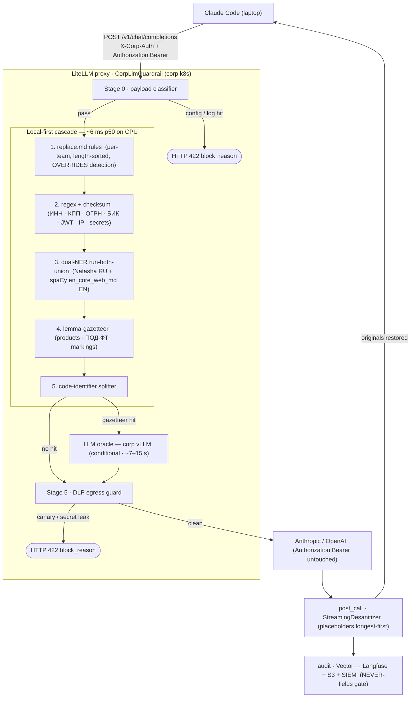

# Architecture — corp-llm-gateway

**English** · [Русский](architecture.ru.md)

Design choice: **Architecture B — assemble best-of-breed.** A single custom Python guardrail
(`corp_llm_gateway.litellm_hook.CorpLlmGuardrail`) is plugged into a LiteLLM proxy as a
callback; everything else (audit pipeline, auth, observability, serving) is provided by
operated open-source components rather than built in-house.

Every request is sanitized in `pre_call`, forwarded to Anthropic / OpenAI with the developer's
BYOK key intact, de-sanitized in `post_call`, and audited.

## Request data flow

## Request lifecycle

1. **Stage 0 — payload classifier**: `.env`, kubeconfig, log-dump signatures → HTTP 422 with
   `block_reason`; upstream is never called.
2. **Local-first cascade** (deterministic, ~6 ms p50 on CPU):
   - `replace.md` per-team rules (length-sorted, OVERRIDES auto-detection)
   - regex + checksum: ИНН / КПП / ОГРН / БИК / СНИЛС / р-счёт, JWT, PEM, `sk-` / `AKIA` / `ghp_`, IPv4/6, internal hostnames
   - dual-NER run-both-union: Natasha/Slovnet (RU) + spaCy `en_core_web_md` (EN) — bilingual ФИО / org / geo
   - lemma-gazetteer: product code-names, regulated ПОД-ФТ terms, confidentiality markings
   - code-identifier splitter: `CompanynameabcService`-style camel/snake identifiers in code
3. **LLM oracle (conditional fallback)**: invoked only on a deterministic gazetteer hit; adds
   Tier-2 coverage for unmarked know-how. Latency ~7–15 s vs ~6 ms local. Two-venv reality:
   Python 3.12 = full NER; Python 3.14 = graceful degradation (NER imports are lazy, `[ner]`
   is an optional extra).
4. **Stage 5 — DLP egress guard**: independent second-layer re-scan of the sanitized outbound
   payload for canary strings and high-confidence secrets; blocks any survivor.
5. **post_call**: `StreamingDesanitizer` rebuilds originals from the per-conversation mapping
   (placeholders sorted longest-first — invariant #5).
6. **audit**: Vector → Langfuse + S3 + SIEM with the NEVER-fields gate.

## Caches

Two caches back the request path:

- **Cache A** — content-keyed dedup, shared across conversations, TTL ~10 h.
- **Cache B** — per-conversation mapping store (Redis or in-memory), sliding TTL ~1 h;
  **required** by `post_call` to reverse redactions. Today `conversation_id == request_id`,
  so Cache B is not yet reused across sibling requests — see [conversation-id.md](conversation-id.md).

## See also

- [security.md](security.md) — sanitization coverage, audit-pipeline guarantees, known config gaps
- [audit-schema.md](audit-schema.md) — event schema + ALWAYS / CONDITIONAL / NEVER field classification
- [conversation-id.md](conversation-id.md) — session-identity model and how to wire a stable session ID
