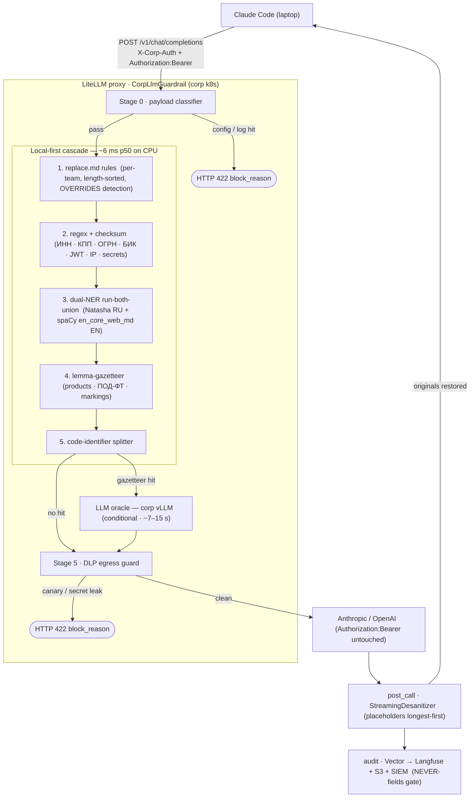

# Архитектура — corp-llm-gateway

[English](architecture.md) · **Русский**

Выбор дизайна: **Архитектура B — сборка из лучших в своём классе компонентов.** Единственный
кастомный Python-guardrail (`corp_llm_gateway.litellm_hook.CorpLlmGuardrail`) встроен в прокси
LiteLLM как callback; всё остальное (конвейер аудита, аутентификация, наблюдаемость, serving) —
на эксплуатируемом open-source, а не написано внутри.

Каждый запрос санитизируется в `pre_call`, форвардится в Anthropic / OpenAI с сохранённым
BYOK-ключом разработчика, де-санитизируется в `post_call` и аудируется.

## Поток данных запроса

## Жизненный цикл запроса

1. **Stage 0 — классификатор payload**: сигнатуры `.env`, kubeconfig, лог-дампов → HTTP 422
   с `block_reason`; upstream не вызывается.
2. **Local-first каскад** (детерминированный, ~6 ms p50 на CPU):
   - правила `replace.md` для каждой команды (сортировка по длине, ПЕРЕОПРЕДЕЛЯЮТ авто-детекцию)
   - regex + checksum: ИНН / КПП / ОГРН / БИК / СНИЛС / р-счёт, JWT, PEM, `sk-` / `AKIA` / `ghp_`, IPv4/6, внутренние hostname
   - dual-NER run-both-union: Natasha/Slovnet (RU) + spaCy `en_core_web_md` (EN) — двуязычные ФИО / организации / гео
   - лемма-газеттир: кодовые имена продуктов, регулируемые термины ПОД-ФТ, грифы конфиденциальности
   - сплиттер идентификаторов кода: camel/snake-идентификаторы вида `CompanynameabcService` в коде
3. **LLM-оракул (условный fallback)**: вызывается только по детерминированному попаданию в
   газеттир; добавляет покрытие Tier-2 для непомеченного ноу-хау. Латентность ~7–15 s против
   ~6 ms у локального пути. Реальность двух venv: Python 3.12 = полный NER; Python 3.14 =
   грациозная деградация (импорты NER ленивые, `[ner]` — опциональный extra).
4. **Stage 5 — DLP egress guard**: независимый пере-скан вторым слоем санитизированного
   исходящего payload на canary-строки и высоконадёжные секреты; блокирует всё, что уцелело.
5. **post_call**: `StreamingDesanitizer` восстанавливает оригиналы из per-conversation
   маппинга (плейсхолдеры отсортированы длиннейшими вперёд — инвариант #5).
6. **аудит**: Vector → Langfuse + S3 + SIEM с гейтом NEVER-полей.

## Кэши

Путь запроса опирается на два кэша:

- **Cache A** — дедуп по содержимому, общий для всех диалогов, TTL ~10 ч.
- **Cache B** — per-conversation хранилище маппинга (Redis или in-memory), скользящий TTL ~1 ч;
  **обязателен** для `post_call`, чтобы обратить редактирование. Сегодня
  `conversation_id == request_id`, поэтому Cache B пока не переиспользуется между родственными
  запросами — см. [conversation-id.ru.md](conversation-id.ru.md).

## См. также

- [security.ru.md](security.ru.md) — покрытие sanitization, гарантии конвейера аудита, известные пробелы конфигурации
- [audit-schema.ru.md](audit-schema.ru.md) — схема события + классификация полей ALWAYS / CONDITIONAL / NEVER
- [conversation-id.ru.md](conversation-id.ru.md) — модель идентификации диалога и как подключить стабильный session ID
